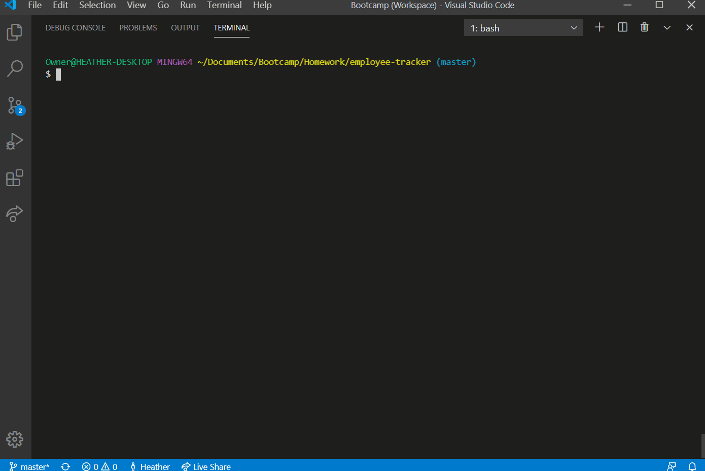
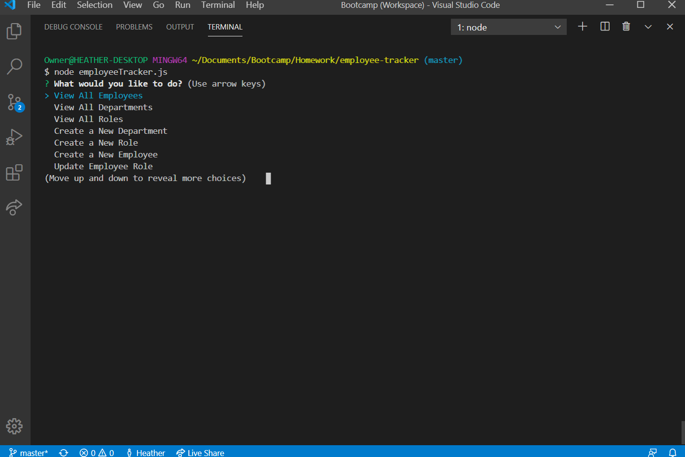
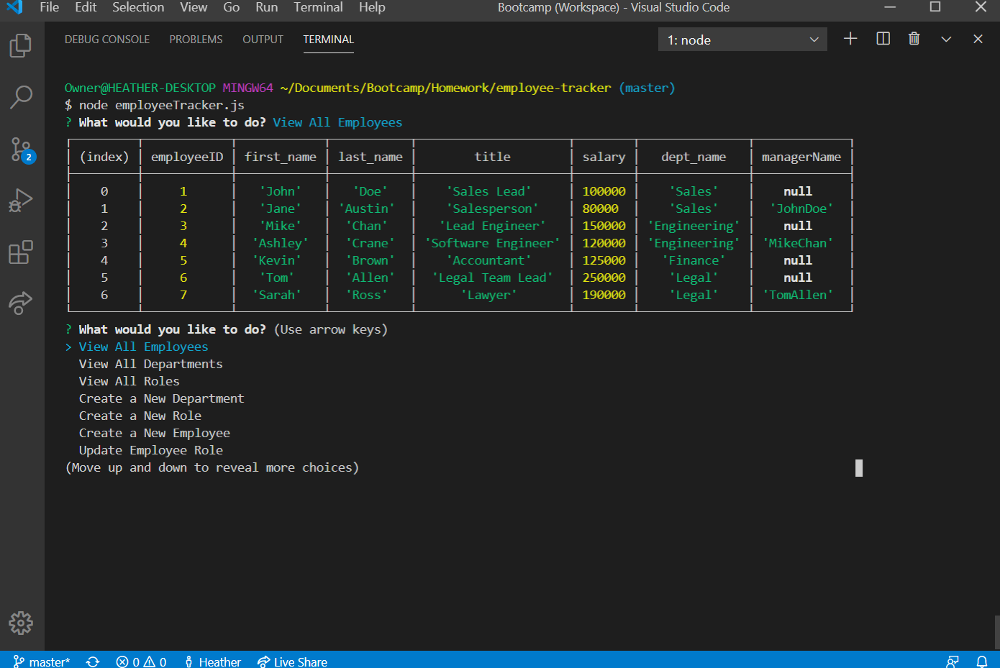
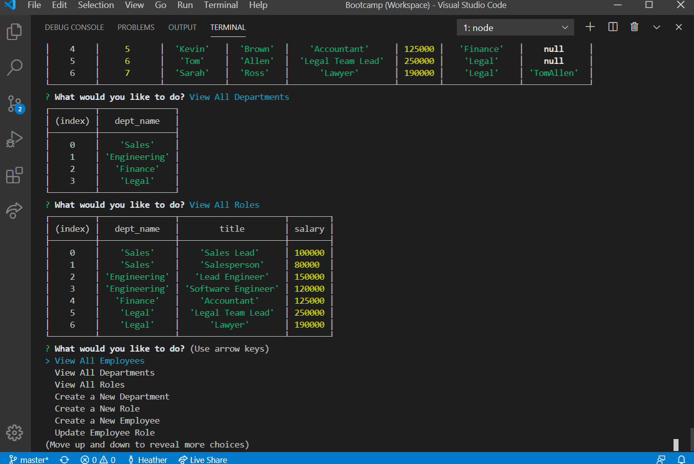

# Employee Tracker


## Description
This is a simple CLI application that tracks employees, roles, and departments. Users can create & add employees, roles, and departments, and even update employee roles.


## Deployment




## Table of Contents

* [Installation](#installation)
* [Technology Used](#technology-used)
* [Usage](#usage)
* [Screenshots](#screenshots)
* [Questions](#questions)
* [Badges](#badges)
* [Authors](#author)
* [Contributing](#contributing)


## Installation
To install the necessary npm dependencies, please run the following command in terminal:
  
```
npm i
```

To install the database schema, please upload the file employeeTrackerSchema.sql located in the db folder using MySQL Workbench.


## Technology Used

Languages
- Javascript

Libraries
- npm inquirer
- npm mysql


## Usage
The user must have SQL server running for the CLI application to run. Initialize the program by typing "node employeeTracker.js" in the command line. This will prompt the start menu where the user may select from several different operations to perform. Completion of an operation will prompt the user back to the start menu.


## Screenshots



*Home Page of Employee Tracker Application*



*View all employees*



*View all roles*


## Questions
If you have any questions about the repo, open an issue or contact [Hlsorrells](github.com/Hlsorrells) directly at [hlsorrells.dev@gmail.com](mailto:hlsorrells.dev@gmail.com).


## Badges


## Author

[Heather Sorrells](mailto:hlsorrells.dev@gmail.com)


## Contributing
Go to GitHub repo and create a pull request or email the developer directly. See [Questions](#questions).

